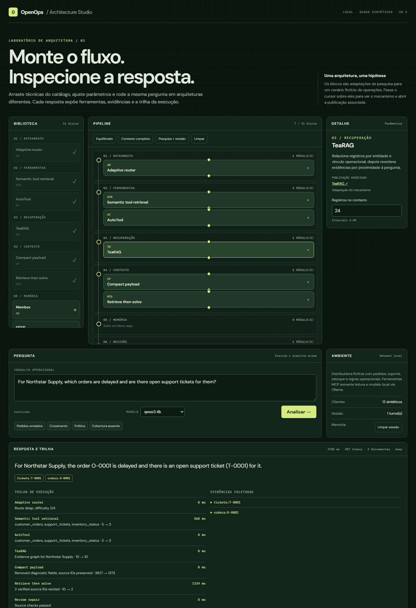

# OpenOps Analyst

A local operations analyst for a fictional distributor. It answers questions across orders, support tickets, inventory, customer profiles, and policy, with source IDs that can be inspected beside the answer. The data and prompts in this repository were created for the demo; no employer code or data is included.



## Run locally

Requires Node.js 24 and [Ollama](https://ollama.com/) running on `127.0.0.1:11434`. The default chat model is `qwen3:4b`; the studio also lists other locally installed chat models.

```bash
npm ci
ollama pull embeddinggemma
ollama pull qwen3:4b
npm run web
```

Open `http://127.0.0.1:4173`. Drag a block from the library into its stage, or click it to add it. Hover over a block to see its purpose, adjustable parameters, and a link to the associated paper in the detail panel. Ask the same question with a different pipeline to compare its answer, citations, tools, token count, and step trace. `?demo=1` runs the default question on load. The pipeline configuration is saved in browser local storage; conversation history stays in the current tab and can be cleared. After a run, use **Fixar última execução** to pin it, change the blocks or parameters, then choose **Comparar com referência**. The comparison reuses the pinned question, model and input history, and shows both answers, citations, tool counts, tokens and latency. It does not add a turn to the conversation.

The command-line workflow and its original three-mode diagnostic are still available:

```bash
npm run ask -- str_cp "For Northstar Supply, which orders are delayed and are there open support tickets for them?"
npm run eval
npm test
npm run typecheck
```

## Architecture Studio

The studio accepts an ordered, validated pipeline. Stages run as route → tool selection → retrieval → context shaping → memory → review. Blocks can be removed, reordered within a stage, or configured independently. Memory strategies are mutually exclusive. Every execution returns the selected tools, evidence, model tokens, elapsed time, answer path, and a trace of each active block.

| Block | What this demo executes | Research link |
| --- | --- | --- |
| Adaptive router (`AR`) | A transparent complexity heuristic changes the tool retrieval budget. It does not train a model router. | [RouteLLM](https://arxiv.org/abs/2406.18665), related inspiration |
| Semantic tool retrieval (`STR`) | EmbeddingGemma ranks tool descriptions; keyword coverage protects explicit tool needs. | [ToolLLM / ToolRetriever](https://arxiv.org/abs/2307.16789), related inspiration |
| AutoTool (`AT`) | Seeded tool-transition edges can add one relevant tool; prior tool sequences in the tab contribute observed edges. | [AutoTool](https://arxiv.org/abs/2511.14650), adaptation |
| TeaRAG (`TR`) | A record graph connects shared customers, orders, and products; personalized propagation ranks the records. This is a small structured-data adaptation, without TeaRAG's full corpus pipeline. | [TeaRAG](https://arxiv.org/abs/2511.05385), adaptation |
| Compact payload (`CP`) | Removes diagnostic fields while preserving operational facts and source IDs. It does not run the LLMLingua compressor. | [LLMLingua](https://arxiv.org/abs/2310.05736), related inspiration |
| Membox (`MB`) | Groups prior turns by customer and operational topic, passing short summaries instead of the full transcript. | [Membox](https://arxiv.org/abs/2601.03785), adaptation |
| MEM1 (`M1`) | Passes the original goal, accumulated question state, and latest observation. This is inference-time context control, not MEM1 training. | [MEM1](https://arxiv.org/abs/2506.15841), inference adaptation |
| ACC (`ACC`) | Builds a bounded state with the recent goal, named entities, mentioned constraints, and latest observation. | [AI Agents Need Memory Control Over More Context](https://arxiv.org/abs/2601.11653), adaptation |
| Retrieve then solve (`RTS`) | Selects source IDs first, then asks the model to solve using the corresponding records. Required records for supported joins and policy checks are retained. | [Context Length Alone Hurts LLM Performance Despite Perfect Retrieval](https://arxiv.org/abs/2510.05381), adaptation |
| Review loop (`RV`) | A separate model pass reviews the draft against the records and requests one revision for concrete issues. | [Self-Refine](https://arxiv.org/abs/2303.17651), related inspiration |
| Review repair (`RR`) | Deterministic checks catch missing citations, incomplete lists, and unsupported policy decisions. It attempts repair, a grounded rule answer, or abstention. | [Reflexion](https://arxiv.org/abs/2303.11366), related inspiration |

The paper labels deliberately distinguish an adapted mechanism from a related idea. This is a portfolio-scale implementation for testing architecture choices on synthetic operational data, not a reproduction of the original papers or of a private production system.

## Under the hood

The legacy CLI uses LangGraph. The studio's configurable runner is a typed pipeline that calls read-only tools through a local MCP server, sends structured requests to Ollama, and filters cited IDs against the records actually supplied to the model. The optional review stages add model critique and record-level invariants. An answer can abstain when the data is missing or its citations cannot be verified.

The API exposes `GET /api/architecture`, `GET /api/models`, and `POST /api/analyze`. A request with `pipeline.blocks` invokes the studio runner; a request with a legacy `mode` (`all`, `str`, `str_cp`) invokes the original LangGraph workflow. No API key is required for the local Ollama setup. The HTTP server binds to `127.0.0.1`.

## Existing local diagnostic

`npm run eval` runs six hand-authored questions in each legacy mode with the same local `qwen3:4b` model. The previously recorded run completed 18/18 requests; full per-case output is in [`results/ablation.json`](results/ablation.json).

| Mode | Mean model tokens | Mean wall time | Required evidence recall | Required citation recall | Policy rule fallbacks |
| --- | ---: | ---: | ---: | ---: | ---: |
| `all` | 1,586 | 2.71 s | 100% | 100% | 2/6 |
| `str` | 818 | 2.29 s | 100% | 100% | 2/6 |
| `str_cp` | 508 | 2.04 s | 100% | 100% | 2/6 |

These figures describe the legacy diagnostic, not the new studio's 11-block configurations. The sample is too small to claim general accuracy or latency gains. Recorded fallback decisions are included in timing and token totals. A valid source ID establishes record provenance, while the explicit checks cover only their coded invariants. All fixtures are fictional.

Core dependencies: [LangGraph](https://docs.langchain.com/oss/javascript/langgraph/quickstart), [Ollama chat](https://docs.ollama.com/api/chat) and [embeddings](https://docs.ollama.com/api/embed), and the [MCP TypeScript SDK](https://github.com/modelcontextprotocol/typescript-sdk/blob/main/docs/get-started/first-server.md).
